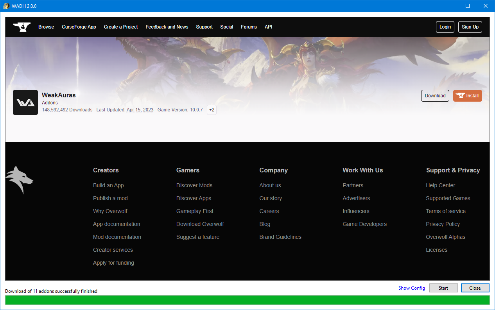

# WADH
A small download helper for World of Warcraft addons

### What it is

- It´s a very simple and tiny .NET 6 application named WADH (**W**orld of Warcraft **A**ddon **D**ownload **H**elper).
- Since my previous download manager (see [section](#why-it-exists) below) was written ages ago, WADH is spoken like "wad-age". 😉
- More explanation (what, why, WADM) <-- TODO
- It´s just a typical ".exe file" Windows application. Just download the newest release, unzip and run it. That´s it. There is no installer, setup or something like that.
- It´s sole purpose is to download a bunch of zip files into a folder. Nothing else. It´s just there to make your life a little bit easier.

### How it works

- Text1
- Text2
- Text3

### Why it exists
I developed a download manager for World of Warcraft addons, called [WADM](https://github.com/mbodm/wadm), over a decade ago. For many many years WADM handled all of your needs with ease, when it comes down to downloading and updating my addons. But since Curse/Overwolf changed their political stance, alternative download managers (like mine, Ajour, WowUp, or others) no longer works with the https://www.curseforge.com site, or their REST web service. The only option is to use their own addon download manager. Many of us don´t want that, for different reasons.

For more information about "the end of all alternative addon download managers" follow the links on the GitHub site of my above mentioned WADM project, or use your GoogleFu.

So, for a while i was OK with downloading the addons manually (which is not the time consuming bottleneck here) and unzipping them (this is the time consuming part). Therefore i wrote a tool named [WAUZ](https://github.com/mbodm/wauz) to make the unzip process way easier. I downloaded the addons with the help of my browser and some direct-download-link bookmarks. While this worked fine enough and made addon updating less painful i still tried some better soltuions here and there.

Awesonium, or other ways to embed a full fledged web browser, did not the trick for me. And web scraping tools like Scrappy, Axios, or Puppeteer were also not my deal. So i tested the Microsoft Edge web engine component (named WebView2) a bit these days. And the result was this small tool. Combined with above mentioned WAUZ tool it makes my live even a bit more easy. :)

### An easy way to grab your addons

Some additional hint here (since this has nothing to do with the tool per se):

A fast and easy way to get all the actual addon zip files is to bookmark all the direct download sites, for every addon, in your browser. Especially for https://www.curseforge.com you can bookmark an addon´s download site directly. The addon download immediately starts, after clicking the bookmark. This helps a lot to get all the latest addon versions very fast, without much effort. This way you quickly have all of them in a single folder. The process of manually unzipping them is way more time consuming. But that´s the moment when WAUZ comes to rescue. :wink:

### Requirements

- 64-bit Windows

There are not any other special requirements. All the release-binaries are compiled with _win-x64_ as target platform, assuming you are using some 64-bit Windows (and that's quite likely).

You can choose between _self-contained_ and _framework-dependent_ .NET application builds, when downloading a release. If you want to run the _framework-dependent_ version, you need (as additional requirement) the .NET 6 runtime installed on your machine. You can find more information about that topic on the [Releases](https://github.com/mbodm/wadh/releases) page.

### Notes
- Note1
- Note2
- Note3

#### Have fun.
